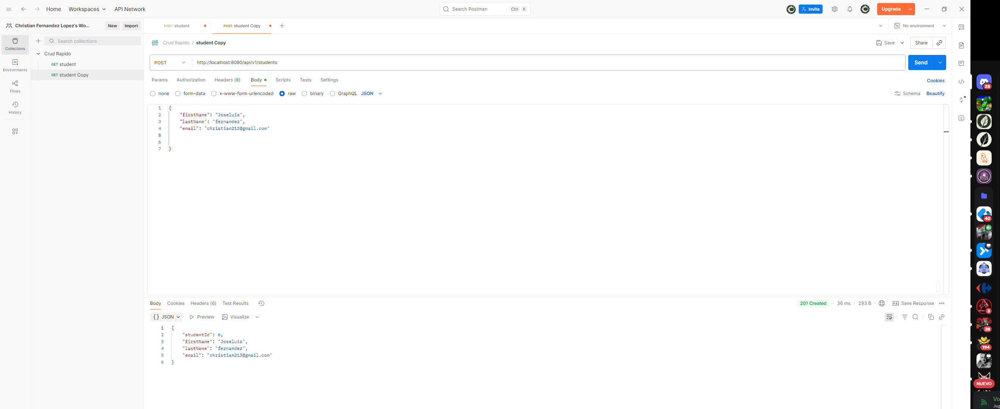
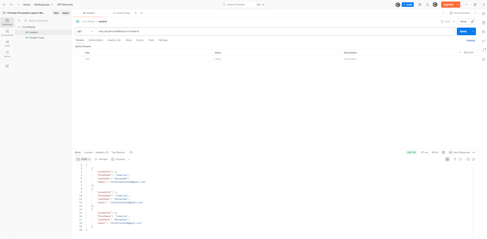

# FastCrud — Students

CRUD REST con Spring Boot.

Requisitos: Java 17, Maven y MySQL (config en application.yml)

# Iniciar programa 

mvn spring-boot:run

URL base: http://localhost:8080

## Endpoints
GET /api/students  
GET /api/students/{id}  
POST /api/students  
PUT /api/students/{id}  
DELETE /api/students/{id}

## Demo

